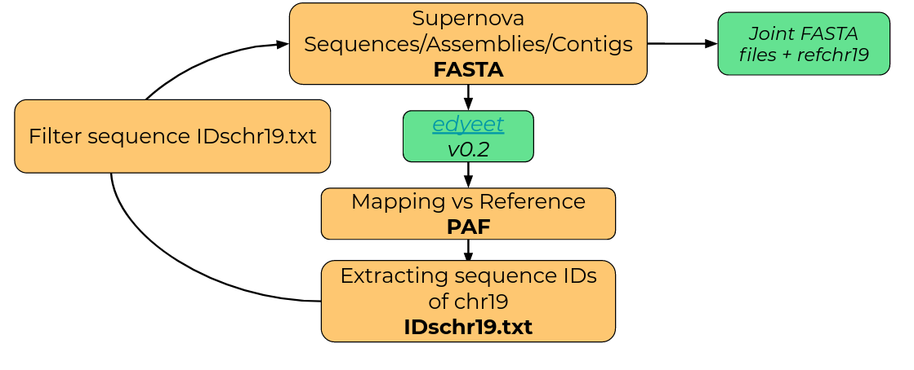
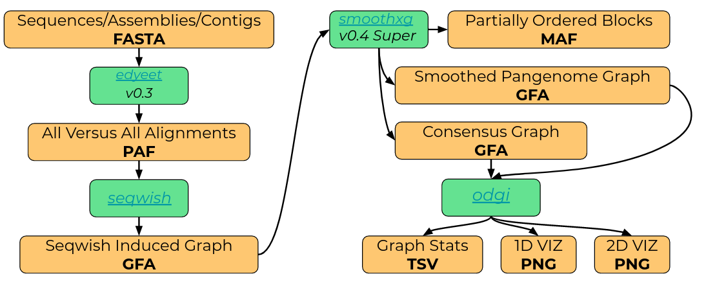

## Pangenome on inbreed populations of mice (subset of 39 strains), BXD family

I started from assembly obtained by Supernova Tool. 

The strains assemblies contain a lot of sequences, which is why I started building chr19's pangenome.

### Step for Selection Chr19's sequences from the Supernova Assemblies 



1. I changed ID for each sequence in each strain.

It is an example of one parental strain:

```shell
awk -F "::" '{if($1~">"){gsub(">","");print ">"$2"DBA2J#"$1} else {print $0}}' /home/flaviav/data/DBA2J_supernova_3lanes_de_novo.fasta | grep -o '^\S*' > DBA2J_supernova_changeid.fasta
```

- So then I join fasta files of 39 strains:

```shell
cat BXD001_supernova_changeid.fasta BXD002_supernova_changeid.fasta BXD005_supernova_changeid.fasta BXD006_supernova_changeid.fasta BXD008_supernova_changeid.fasta BXD009_supernova_changeid.fasta BXD011_supernova_changeid.fasta BXD012_supernova_changeid.fasta C57BL6J_supernova_changeid.fasta DBA2J_supernova_changeid.fasta........... > C57BL6J+DBA2J+BXD001+BXD002+BXD005+BXD006+BXD008+BXD009+BXD011+BXD012_supernova_changeid.fa
```

- I mapped all strains against whole reference of mouse:

```shell
time edyeet -m -N -p 95 -Y '#' -t 20 -Q <(ls C57BL6J+DBA2J+BXD001+BXD002+BXD005+BXD006+BXD008+BXD009+BXD011+BXD012_supernova_changeid.fa.gz | sort -V ) UCSC_mm10_changeid.fa > C57BL6J+DBA2J+BXD001+BXD002+BXD005+BXD006+BXD008+BXD009+BXD011+BXD012vsref.paf
```

- I extracted IDs sequences of chr19:

```shell
echo 19 | while read i; do awk '$6 == "REF#chr'$i'"' C57BL6J+DBA2J+BXD001+BXD002+BXD005+BXD006+BXD008+BXD009+BXD011+BXD012vsref.paf; done | cut -f 1 | sort -V > id_C57BL6J+DBA2J+BXD001+BXD002+BXD005+BXD006+BXD008+BXD009+BXD011+BXD012vsref.chr19.txt
```

- I extracted only IDs that I isoleted with the previous step for obtained only sequences of chr19 from fasta files:

```shell 
cat id_C57BL6J+DBA2J+BXD001+BXD002+BXD005+BXD006+BXD008+BXD009+BXD011+BXD012vsref.chr19.txt | while read line ; do samtools faidx C57BL6J+DBA2J+BXD001+BXD002+BXD005+BXD006+BXD008+BXD009+BXD011+BXD012_supernova_changeid.fa $line; done > C57BL6J+DBA2J+BXD001+BXD002+BXD005+BXD006+BXD008+BXD009+BXD011+BXD012_chr19.fa
```

## Build a pangenome of chr19 with pggb (https://github.com/pangenome/pggb):




## 1. I tried several command lines to obtained the best mapping and best pangenome from 39 strains.
These are the best:

```shell
./pggb -i 39strains_chr19+ref_chr19.fa -a 0 -s 5000 -l 15000 -p 99 -w 30000 -j 5000  -e 5000 -n 6 -t 20 -Y "#" -k 29 -K 16 -I 0.5 -R 0.2 -o pang5000

./pggb -i 39strains_chr19+ref_chr19.fa -a 0 -s 8000 -p 98 -w 300000 -j 8000 -e 8000 -n 6 -t 20 -Y "#" -S -k 29 -I 0.6 -R 0.2 -o pang8000
```

I'm based on the output obtained by the last command:

- Stastics on GFA obtained by seqwish: 


GFA           | Length        | Nodes      | Edges   |  Paths
--------------| -------------  | -------------- |--------- | -----------
 seqwish             | 257572767              | 1406518               |  2521219       | 19773

 
- Statistics on GFA obtained by smoothxg:

GFA           | Length        | Nodes      | Edges   |  Paths
--------------| -------------  | -------------- |--------- | -----------
smoothxg      | 223294493              | 9891933               |  14023885       | 99633


## 2. On the smoothxg pangenome I called variant with gfautil:

```shell
env TMPDIR=~/data/tmp gfautil --debug -t 20 -i 39strains_chr19+ref_chr19.fa.pggb-E-s8000-l24000-p98-n6-a0-K16-k29-w300000-j8000-e8000-I0.6-R0.2.smooth.gfa gfa2vcf --refs "REF#chr19" > 39strains_s8000_smooth_pangenome.vcf
```  


## 3. I Normalized and decomposed the gfautil's output:

```shell
env TMPDIR=~/data/tmp vt index 39strains_s8000_smooth_pangenome.vcf.gz

env TMPDIR=~/data/tmp vt normalize -n 39strains_s8000_smooth_pangenome.vcf.gz -r /home/flaviav/data/UCSC_mm10_chr19_only.fa | vt uniq - -o 39strains_s8000_smooth_pangenome.norm.uniq.vcf

env TMPDIR=~/data/tmp vt decompose 39strains_s8000_smooth_pangenome.norm.uniq.vcf -o 39strains_s8000_smooth_pangenome.norm.uniq.decomp.vcf

vt peek 39strains_s8000_smooth_pangenome_norm_uniq_decomp.vcf
```
## 4. Statistics on 39strains_s8000_smooth_pangenome_norm_uniq_decomp.vcf

```shell
bcftools stats 39strains_s8000_smooth_pangenome.norm.uniq.decomp.vcf > 39strains_s8000_smooth_pangenome.norm.uniq.decomp.bcf-stats

plot-vcfstats -p outdir 39strains_s8000_smooth_pangenome.norm.uniq.decomp.bcf-stats

vcftools --vcf 39strains_s8000_smooth_pangenome.norm.uniq.decomp.vcf --het --out output.het #it doesn't work because there isn't the GT format
```

gfautil 0.4.0.alpha.3: the number of indels is high.

Variants          | Number       
--------------| -------------  
 SNP        | 64464 
 MNP    | 11832
 INDEL  | 403019
 SNP/MNP | 1863
 SNP/INDEL | 25402
 MNP/INDEL | 12062
 MNP/CLUMPED | 745
 INDEL/CLUMPED | 34304
 
So with the new version I called variants on seqwish's output and smoothxg's output, to try to understand the differences and if there are problems in the smoothxg.

gfautil 0.4.0.alpha.4: the number of indels decreased

Variants  SMOOTHXG        | Number       
--------------| -------------  
totatal Variants | 150207
biallelic variants | 148215
multiallelic variants | 1992
SNP        | 42838  
MNP    | 7304
INDEL  | 58504
SNP/MNP | 690
SNP/INDEL | 12623
MNP/INDEL | 	6060
MNP/CLUMPED | 336
INDEL/CLUMPED | 24255
 
 [Variants on smoothxg pangenome](https://github.com/Flavia95/Rplots/blob/main/plots/distributiononpangenomeof39strainsaftersmoothxg.png)

- So I called variants also on the seqwish's GFA:

gfautil 0.4.0.alpha.4

Variants          | Number       
--------------| -------------  
totatal Variants |  47184
biallelic variants | 46770
multiallelic variants | 414
SNP        | 12453   
MNP    | 	924
INDEL  | 3536
SNP/MNP | 237
SNP/INDEL | 412
MNP/INDEL | 	729
MNP/CLUMPED | 4657
INDEL/CLUMPED |  24717 

[Variants on seqwish pangenome](https://github.com/Flavia95/Rplots/blob/main/plots/distributiononpangenomeof39strainsafterseqwish.png)
 
 - I check the distribution of INDELS, it seems things are everywhere.

[Distribution of deletions](https://github.com/Flavia95/Rplots/blob/main/plots/distributiofdel.png)
 
[Distribution of insertions](https://github.com/Flavia95/Rplots/blob/main/plots/Distributionofins.png)

## Gfautil on HLA region (L-3139) against vg

```shell
odgi build -g L-3139.sort.gfa -o L-3139.sort.og
odgi stats -S -i L-3139.sort.og
```
#length nodes   edges   paths
7473    242     324     8


- VG
```shell
vg view -Fv L-3139.sort.gfa > L-3139.vg
vg index  L-3139.vg -x  L-3139.xg
vg deconstruct -p "gi|528476637:30229380-30236765" L-3139.xg > L-3139.vg.vcf

vt index L-3139.vg.vcf
vt normalize -n L-3139.vg.vcf.gz -r refL-3139.fa | vt uniq - -o L-3139.vg.norm.uniq.vcf
vt decompose L-3139.vg.norm.uniq.vcf -o L-3139.vg.norm.uniq.decomp.vcf
vt peek L-3139.vg.norm.uniq.decomp.vcf 
```

Variants          | Number       
--------------| -------------  
totatal Variants |  82
biallelic variants | 81
multiallelic variants | 1
SNP        | 70   
MNP    | 	3
INDEL  | 9
SNP/MNP | 1

- GFAUTIL

```shell

gfautil --debug -t 20 -i L-3139.sort.gfa gfa2vcf --refs "gi|528476637:30229380-30236765" > L-3139.gfautil.vcf
vt index L-3139.gfautil.vcf.gz
vt normalize L-3139.gfautil.vcf.gz -n -r refL-3139.fa | vt uniq - -o L-3139.gfautil.norm.uniq.vcf
vt decompose L-3139.gfautil.norm.uniq.vcf -o L-3139.gfautil.norm.uniq.decomp.vcf
vt peek L-3139.gfautil.norm.uniq.decomp.vcf

```

Variants          | Number       
--------------| -------------  
totatal Variants |  83
biallelic variants | 83
multiallelic variants | 0 
SNP        | 72   
MNP    | 	2
INDEL  | 9
SNP/MNP | -

 
## On the last command of pggb for 39 strains:

```shell
./pggb -i 39strains_chr19+ref_chr19.fa -a 0 -s 8000 -p 98 -w 300000 -j 8000 -e 8000 -n 6 -t 20 -Y "#" -S -k 29 -I 0.6 -R 0.2 -o pang8000
```

**I redo smoothxg:**

```shell
smoothxg -t 20 -g pang8000_newversionsmoothxg/39strains_chr19+ref_chr19.fa.pggb-E-s8000-l24000-p98-n6-a0-K16-k29.seqwish.gfa -w 300000 -M -J 0.7 -K -I 0.6 -R 0.2 -j 8000 -e 8000 -l 10000 --poa-params 1,9,16,2,41,1 -m pang8000_newversionsmoothxg/39strains_chr19+ref_chr19.fa.pggb-E-s8000-l24000-p98-n6-a0-K16-k29.seqwish-w300000-j8000-e8000-I0.6.smooth.maf -C pang8000_newversionsmoothxg/39strains_chr19+ref_chr19.fa.pggb-E-s8000-l24000-p98-n6-a0-K16-k29.seqwish-w300000-j8000-e8000-I0.6.smooth.consensus,10,100,1000,10000 -o pang8000_newversionsmoothxg/39strains_chr19+ref_chr19.fa.pggb-E-s8000-l24000-p98-n6-a0-K16-k29.seqwish-w300000-j8000-e8000-I0.6.smooth.poa.gfa
```
On this output again I redo:

```shell
gfautil --debug -t 20 -i 39strains_chr19+ref_chr19.fa.pggb-E-s8000-l24000-p98-n6-a0-K16-k29.seqwish-w300000-j8000-e8000-I0.6.smooth.poa.gfa gfa2vcf --refs "REF#chr19" > 39strains_s8000_smooth.poa.vcf
```
The situation has improved:

BEFORE:

GFA           | Length        | Nodes      | Edges   |  Paths
--------------| -------------  | -------------- |--------- | -----------
smoothxg      | 223.294.493              | 9891933               |  14023885       | 99633

**SNPs--> 42838  
INDELs--> 58504**


AFTER:

GFA           | Length        | Nodes      | Edges   |  Paths
--------------| -------------  | -------------- |--------- | -----------
after add --POA      | 222.685.003             |  6195970               |  9332308       | 80179

**SNPs--> 16390**

**INDELs--> 15395**
